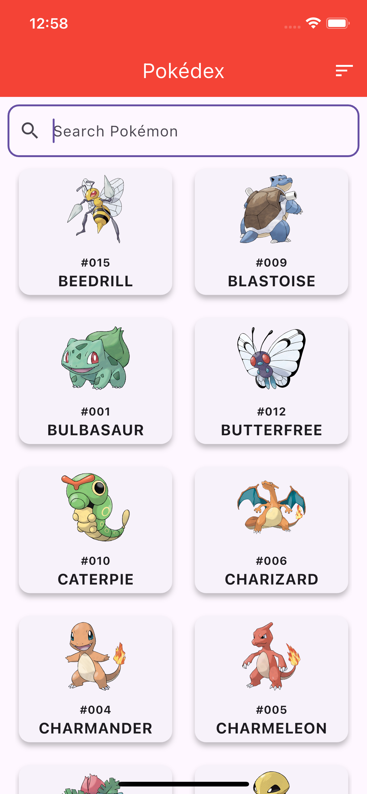
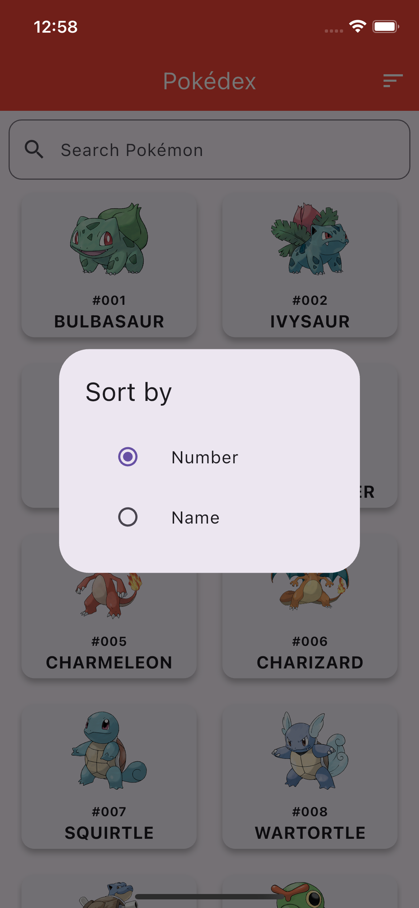
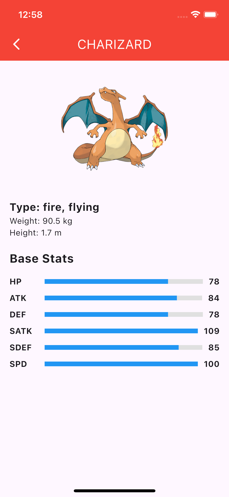

# 🏆 Flutter Pokédex App

A beautiful and functional **Pokédex app** built with **Flutter**, consuming the [PokéAPI](https://pokeapi.co/).

This app demonstrates **Clean Architecture, SOLID principles, state management, and API handling**.

---

## ✨ Features

✅ Fetch Pokémon list dynamically from API  
✅ Infinite scrolling (pagination)  
✅ Sorting by **Number** and **Name**  
✅ Search Pokémon by name  
✅ Pokémon Detail View with **Stats, Type, Height, Weight**  
✅ **Animations for smooth UI experience**  
✅ Uses **Provider** for state management  
✅ Implements **Dio** for API calls  
✅ **Modular architecture** following **Clean Code**

---

## 📸 Screenshots

| Pokémon List | Sorting | Pokémon Details |
|-------------|---------|----------------|
|  |  |  |

---

## 🚀 Installation Guide

### **1️⃣ Clone the repository**
git clone https://github.com/jerry6891/PokeDexApp.git
cd PokeDexApp

---

## 🔧 Compilation Guide

### **2️⃣ How to compile and/or run in Visual Studio Code or in Terminal?**
flutter run -d <device-iOS-Simulator-ID> || flutter run -d macos

---

## 🔧 Compilation Guide

### **2️⃣ How to compile and/or run in Visual Studio Code or in Terminal?**
flutter run -d <device-iOS-Simulator-ID> || flutter run -d macos